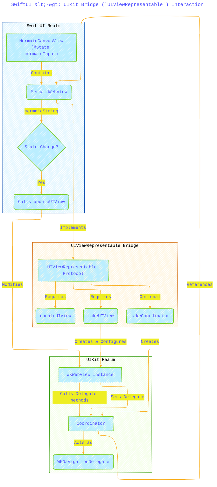
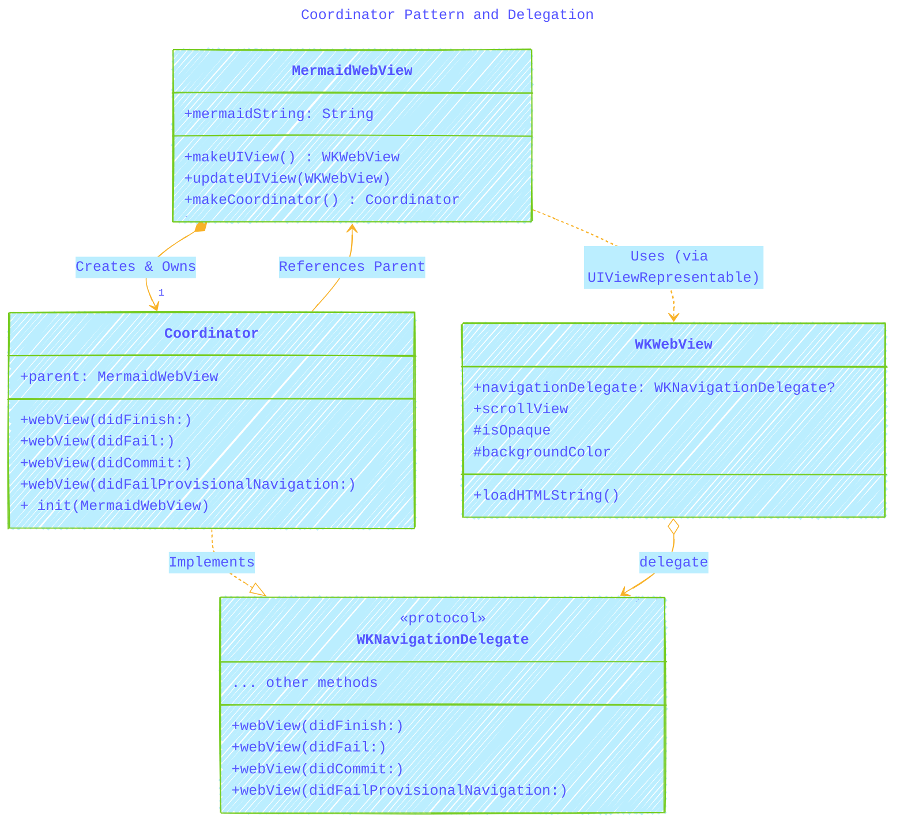
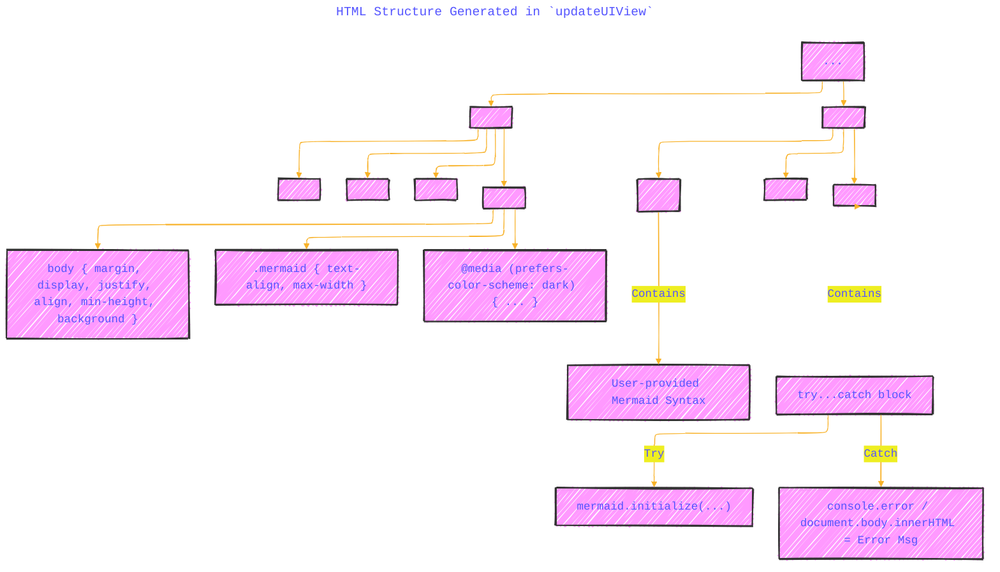
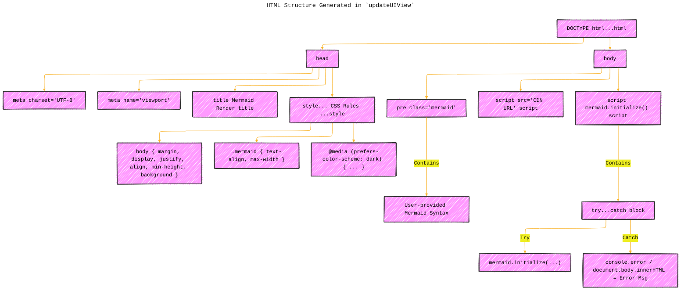
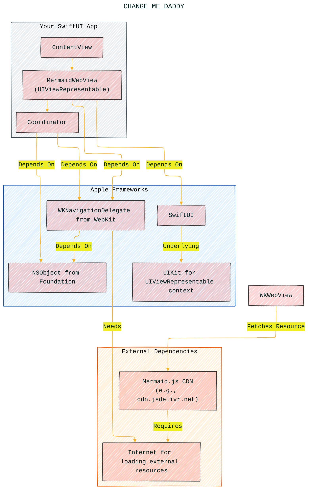

# A Diagrammatic Guide
> **Disclaimer:**
>
> This document contains my personal notes on the topic,
> compiled from publicly available documentation and various cited sources.
> The materials are intended for educational purposes, personal study, and reference.
> The content is dual-licensed:
> 1. **MIT License:** Applies to all code implementations (Swift, Mermaid, and other programming languages).
> 2. **Creative Commons Attribution 4.0 International License (CC BY 4.0):** Applies to all non-code content, including text, explanations, diagrams, and illustrations.
---

---

Let's break down the provided Swift code and illustrate the underlying concepts and interactions using Mermaid diagrams. 

The code defines a SwiftUI view (`MermaidWebView`) that uses `UIViewRepresentable` to wrap a `WKWebView` for rendering Mermaid diagrams defined in a string.

Here's a collection of diagrams explaining the key aspects:

## 1. SwiftUI <-> UIKit Bridge (`UIViewRepresentable`) Interaction

This diagram shows the high-level interaction between the SwiftUI world and the UIKit world facilitated by `UIViewRepresentable`.

*   **Explanation:** This flowchart illustrates the bridge between SwiftUI and UIKit.
    *   `ContentView` holds the state (`mermaidInput`).
    *   When `mermaidInput` changes, SwiftUI detects the state change.
    *   `MermaidWebView`, conforming to `UIViewRepresentable`, is responsible for the bridge.
    *   `makeUIView` is called *once* initially to create the `WKWebView` instance.
    *   `updateUIView` is called initially *and* whenever the `mermaidString` input changes, triggering the reload of HTML content in the `WKWebView`.
    *   The optional `Coordinator` is created via `makeCoordinator` and set as the `WKWebView`'s `navigationDelegate` to handle navigation events (like load success or failure).

---

## 2. Rendering Pipeline: From String to Diagram

This sequence diagram details the flow of data and actions when the Mermaid string is updated and rendered.

*   **Explanation:** This diagram shows the sequence of events:
    1.  User input modifies the `@State` variable in `ContentView`.
    2.  SwiftUI detects the change and calls `updateUIView` on `MermaidWebView`.
    3.  `MermaidWebView` dynamically builds an HTML document containing the Mermaid syntax, styling, and necessary JavaScript (including the CDN link and initialization code).
    4.  The `WKWebView` is instructed to load this HTML string.
    5.  The `WKWebView` fetches the external Mermaid.js library from the CDN.
    6.  Once the HTML is parsed and the external script is loaded, the inline initialization script (`mermaid.initialize`) runs.
    7.  Mermaid.js finds the `<pre class="mermaid">` tag, parses its content, and renders it (typically as an SVG) within the WebView.

-----

## 3. Coordinator Pattern and Delegation

This class diagram shows the relationship between `MermaidWebView`, its `Coordinator`, and the `WKWebView`'s delegation mechanism.

*   **Explanation:**
    *   `MermaidWebView` creates and holds a reference to its `Coordinator`.
    *   The `Coordinator` holds a reference back to the `MermaidWebView` (`parent`) to potentially pass data or trigger actions in the SwiftUI view if needed.
    *   The `Coordinator` conforms to the `WKNavigationDelegate` protocol, implementing methods to react to WebView navigation events.
    *   The `WKWebView` instance created in `makeUIView` has its `navigationDelegate` property set to the `Coordinator` instance. This connects the WebView's events to the `Coordinator`'s methods.

---

## 4. HTML Structure Generated in `updateUIView`

This diagram visualizes the structure of the HTML string being constructed and loaded into the `WKWebView`.

*   **Explanation:** This flowchart breaks down the HTML structure:
    *   Standard HTML boilerplate (`DOCTYPE`, `html`, `head`, `body`).
    *   `<head>` includes metadata, title, and crucial `<style>` block for basic layout, centering, and optional dark mode.
    *   `<body>` contains the core elements:
        *   The `<pre class="mermaid">` tag, which is essential for Mermaid.js to find the syntax. The user's `mermaidString` is injected here.
        *   A `<script>` tag to load the Mermaid.js library from the specified CDN.
        *   An inline `<script>` tag to execute `mermaid.initialize()`, which starts the rendering process. This script also includes basic `try...catch` JavaScript error handling.

Note: The diagram version below used to display the text since we have issues with special characters when rendering Mermaid syntax.

----

## 5. Potential States and Error Handling Points

This state diagram shows the different phases the WebView might go through and where errors can occur.

*   **Explanation:** This diagram highlights the lifecycle and potential failure points:
    *   Starts in an `Initializing` state.
    *   Moves to `LoadingHTML` when `updateUIView` calls `loadHTMLString`. Failure here triggers `didFailProvisionalNavigation`.
    *   If HTML loads, it proceeds to `FetchingJS` (Mermaid library from CDN). Network errors or other load issues here trigger `didFail`.
    *   If JS is fetched, it enters `Rendering` where `mermaid.initialize` runs. JavaScript errors (e.g., syntax errors in Mermaid code, Mermaid library issues) are caught by the `try...catch` block within the HTML.
    *   Successful rendering leads to the `Success` state.
    *   Failures (Navigation or JavaScript) lead to a `FailedState`. The `Coordinator` handles navigation errors, while the JavaScript `catch` block handles initialization errors.

---

## 6. Component Dependencies

This diagram illustrates the internal and external dependencies involved.

*   **Explanation:** This diagram shows the layers of dependencies:
    *   **Your App:** Contains the specific SwiftUI Views (`ContentView`, `MermaidWebView`) and the `Coordinator`.
    *   **Apple Frameworks:** Your app relies heavily on SwiftUI, WebKit (for `WKWebView`), UIKit (needed for `UIViewRepresentable` and `WKWebView`), and Foundation (basic types).
    *   **External Dependencies:** The crucial external dependency is the Mermaid.js library hosted on a CDN. Accessing this CDN requires an active Internet connection for the `WKWebView`.

## 7. Adding Mermaid.js as a local bundle resource in iOS device

Download the raw Mermaid js package by following the CDN link below.
https://www.jsdelivr.com/package/npm/mermaid

Please note that you can switch versions through the dropdown box at the top right.

After download the Mermaid package, go the the package folder to get the raw file `mermaid.min.js`.

then, integrate the `mermaid.min.js` file into your Xcode project, following the steps below:

**Add to Project Bundle:** Include the downloaded `.js` file in your Xcode project and ensure it's part of your app target's "Copy Bundle Resources" build phase.

**Update HTML:** Modify the `<script src="...">` tag within the generated HTML to point to the *relative path* of the local `mermaid.min.js` file.

**Set Base URL:** When loading the HTML string into the `WKWebView`, provide the URL of the app's main bundle resource directory as the `baseURL`. This tells the `WKWebView` where to look for files referenced with relative paths (like `mermaid.min.js`).

---
**Licenses:**

- **MIT License:**   - Full text in [LICENSE](LICENSE) file.
- **Creative Commons Attribution 4.0 International:**  - Legal details in [LICENSE-CC-BY](LICENSE-CC-BY) and at [Creative Commons official site](http://creativecommons.org/licenses/by/4.0/).

---